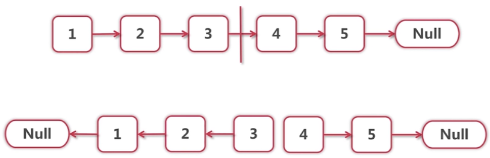
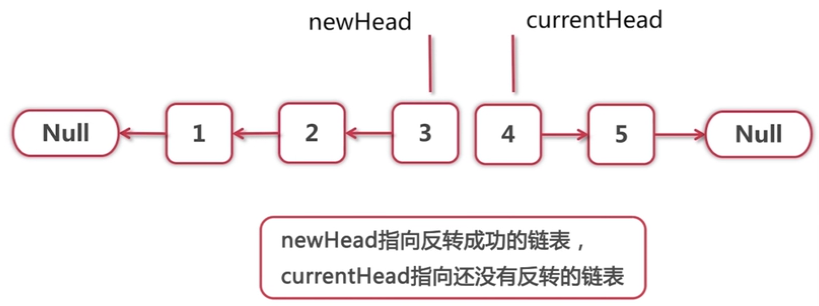
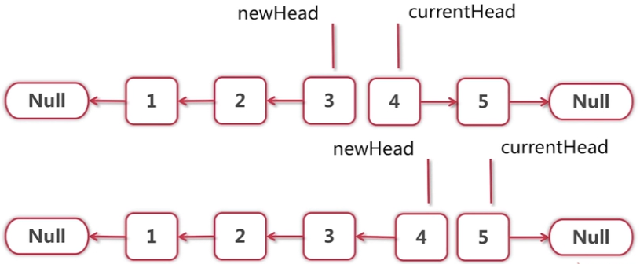
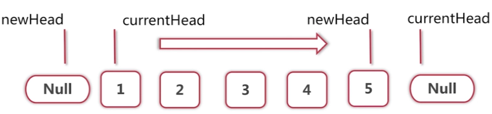
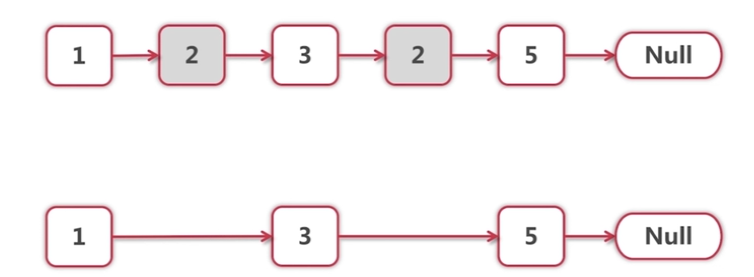
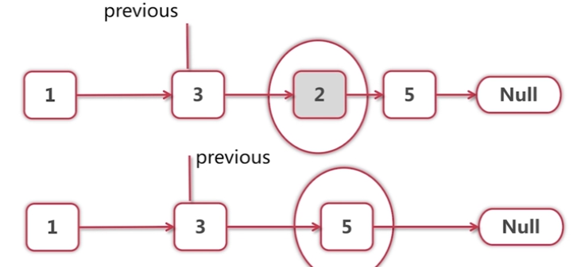

# 链表反转
> 递归实现 （缺点：如果有100万个节点，递归就要调100万次，系统开销很大）


 

```java
public class LinkedListReverser {
    
    // 函数返回的是反转后的头节点
    public Node reverse(Node head) {
        if (head == null || head.next == null) {
            return head;
        }
        
        Node newHead = reverse(head.next);
        head.next.next = head;
        head.next = null;
        return newHead;
    }
}
```

> 循环写法  
定义循环不变式  
定义一句断言，让这句断言在整个循环中都是成立的  

循环一般从中间状态开始考虑，而不是第一次循环，第一次循环需要考虑太多边界条件。  

考虑中间节点，假设已经循环了3次，1，2，3已经反转，4和5还没有动



3和4断掉了，各放一个变量来维持住3和4这两个节点



newHead指向反转成功的链表，currentHead指向还没有反转的链表这句话，  
从循环的开始到循环的结束，在每一次的循环体中，都要成立。
  
接下来，要把newHead和currentHead向前推进，并且推进1



再想想初始的时候，newHead和currentHead应该指向什么，因为循环开始之前，这句话也要成立
  
newHead应该指向null，currentHead应该指向第一个节点 


然后一步一步向右推进，推进到当newHead指向5，currentHead指向null，就会发现newHead就是我们要的结果



```java
public class LinkedListReverser {
    
    public Node reverse(Node head) {
        Node newHead = null;
        Node currentHead = head;
        // Loop invariant:
        // newHead points to the linked list already reversed.
        // curHead points to the linked list not yet reversed.
        while (currentHead != null) {
            // Loop invariant holds.
            Node next = currentHead.next;
            currentHead.next = newHead;
            newHead = currentHead;
            currentHead = next;
            // Loop invariant holds.
        }
        // Loop invariant holds.
        return newHead;
    }
}

```

# 链表中 delete if

比如删除值为2的节点



把问题从中间切开，那么久假设第一个2已经被删掉了，现在要删除第二个2，  
这一轮循环要处理的就是这个2，只要把3指向5就行了，但是要把3指向5，就需要一个指针指向3，
删除后看下一个节点

循环不变式就是：从链表开头到节点previous，所有值为2的节点都被删除  
然后考虑previous的next节点是否是2，是的话就删除，不是的话就把previous向后移一格  
（删掉的情况下不移动previous，不然连续两个2就删不掉）



还有一个问题是头节点，如果第一个节点就是2怎么处理？它没有previous  
有两种处理方法：

- 特殊处理
- 增加虚拟头节点

> 循环写法

```java
public class LinkedListDeletor {
    public Node deleteIfEquals(Node head, int value) {
        while (head != null && head.value == value) {
            head = head.next;
        }
        
        // 如果链表都是要删除的元素，这样的话head到这一步还是可能为null
        if (head == null) {
            return null;
        }
        
        Node prev = head;
        // Loop invariant:list nodes from head up to prev has been
        // processed. (Nodes with values equal to value are deleted.)
        
        // 我们已经假设上面注释的循环不变式成立，链表开头到prev的借点已经
        // 正确处理，所以这里不考虑prev == null的情况        
        while(prev.next != null) {
            if (prev.next.value == value) {
                // delete it
                prev.next = prev.next.next;
            } else {
                prev = prev.next;
            }
        }
        
        return head;
    }
}
```