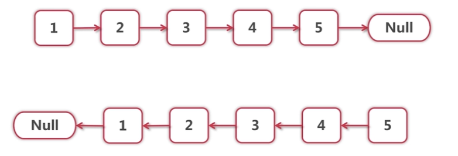
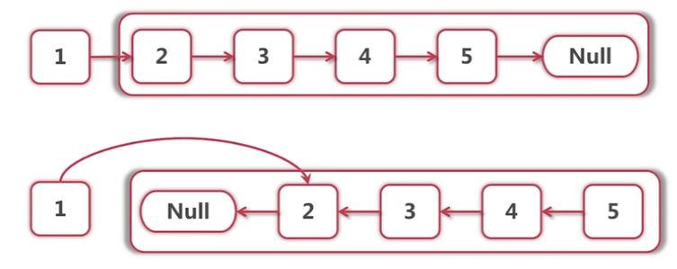
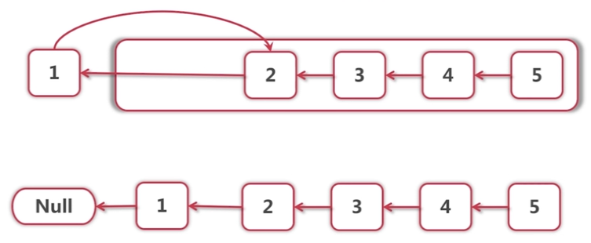

# 链表反转
> 递归实现


***

***  
 
```
// 函数返回的是反转后的头节点
public Node reverse(Node head) {
    if (head == null || head.next == null) {
        return head;
    }
    
    Node newHead = reverse(head.next);
    head.next.next = head;
    head.next = null;
    return newHead;
}
```