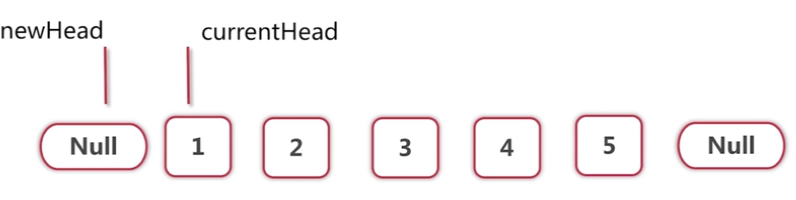

# 链表反转
> 递归实现 （缺点：如果有100万个节点，递归就要调100万次，系统开销很大）


 

```java
public class LinkedListReverser {
    
    // 函数返回的是反转后的头节点
    public Node reverse(Node head) {
        if (head == null || head.next == null) {
            return head;
        }
        
        Node newHead = reverse(head.next);
        head.next.next = head;
        head.next = null;
        return newHead;
    }
}
```

> 循环写法

  

1.定义循环不变式  
定义一句断言，让这句断言在整个循环中都是成立的  
考虑中间节点，假设已经循环了3次，1，2，3已经反转，4和5还没有动


3和4断掉了，各放一个变量来维持住3和4这两个节点


newHead指向反转成功的链表，currentHead指向还没有反转的链表这句话，  
从循环的开始到循环的结束，在每一次的循环体中，都要成立。
  
接下来，要把newHead和currentHead向前推进，并且推进1


再想想初始的时候，newHead和currentHead应该指向什么，因为循环开始之前，这句话也要成立
  
newHead应该指向null，currentHead应该指向第一个节点 



然后一步一步向右推进，推进到当newHead指向5，currentHead指向null，就会发现newHead就是我们要的结果


```java
public class LinkedListReverser {
    
    public Node reverse(Node head) {
        Node newHead = null;
        Node currentHead = head;
        // Loop invariant:
        // newHead points to the linked list already reversed.
        // curHead points to the linked list not yet reversed.
        while (currentHead != null) {
            // Loop invariant holds.
            Node next = currentHead.next;
            currentHead.next = newHead;
            newHead = currentHead;
            currentHead = next;
            // Loop invariant holds.
        }
        // Loop invariant holds.
        return newHead;
    }
}

```