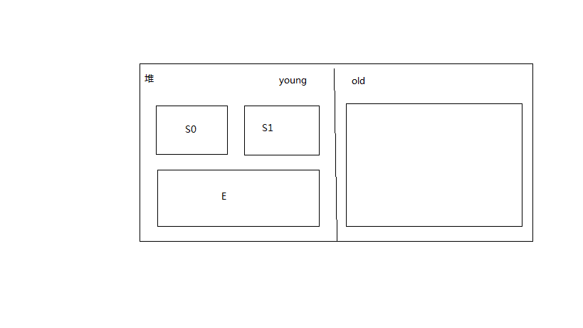

# 垃圾回收
> 判断对象是否应该被清理的标准

GCRoot，栈直接或间接引用，或本地方法栈直接或间接引用，或方法区直接或间接引用的对象是不能被删除的，其余的就可以删除了。

> 清理的思路
- 标记-清理  
方法：把要删除的对象打上标记，然后把所有含有标记的对象删除；  
缺点：会产生内存碎片；
***
- 标记-整理  
方法：清理对象后，存在的对象往前挪；  
缺点：代价大，对象需要往前挪；
***
- 复制算法  
方法：把内存一分为二，在一块内存上创建对象，清理时标记对象，然后把不需要删除的对象紧凑复制到另一块内存；  
缺点：需要两倍的内存；

# 实际的GC过程
  
一开始对象都在E区创建，当E区快满的时候触发young GC，young GC采用复制算法，要删除的对象打上标记，剩下的复制到S0区，然后把E区和S1区都删除，下一次E区快满的时候，把E区和S0区打标，剩下的复制到S1区，如此交替使用S0和S1区；  
***
每一次young GC活下来的对象，年龄就会+1，满6岁的对象就会复制到old区；  
（因为6次GC都能存活，说明这个对象可能还会存在很长时间）  
***
此外，old区还会存一些大的对象，比如很大的数组，old区快满了也会触发old GC，old GC一般会伴随着young GC，所以也叫full GC，
这个会引起stop the world（整个java程序暂停，进行垃圾回收），full GC一般使用标记-清除和标记-整理算法；
